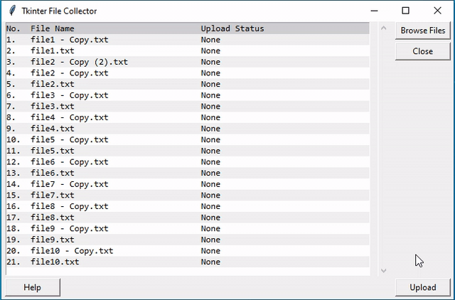

# Tkinter File Collector
![Python][python-shield]

GUI based file uploader using tkinter



Collect files from client and send them to a server using multipart form POST requests.
## Build

```
pyinstaller --onefile FileCollector.py
```

## Usage example

1. Ensure your server is up and listening for requests. You can use a dummy nodejs server:
```
node DummyServer.js
```
2. Run the python application
Source:
```
python FileCollector.py
```
 or
Windows executable:
```
.\dist\FileCollector.exe
```

## Prerequisites

```
pip install urllib3
```

<!-- Markdown link & img dfn's -->
[python-shield]: https://img.shields.io/badge/python-3.8.3-green

## Customize:

* Change your API url inside the post() method:
```
url="http://localhost:8080/upload"
```
* Change your form field name and request body inside the post() method:
```
payload = "------WebKitFormBoundary7MA4YWxkTrZu0gW\r\nContent-Disposition: form-data; name=\"fileupload\"; filename=\"{0}\"\r\nContent-Type: text/plain\r\n\r\n{1}\r\n------WebKitFormBoundary7MA4YWxkTrZu0gW--".format(fileName,fileContent)

```
